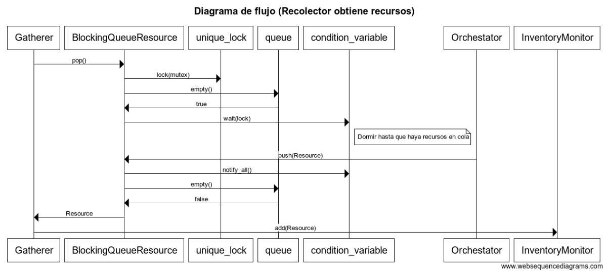
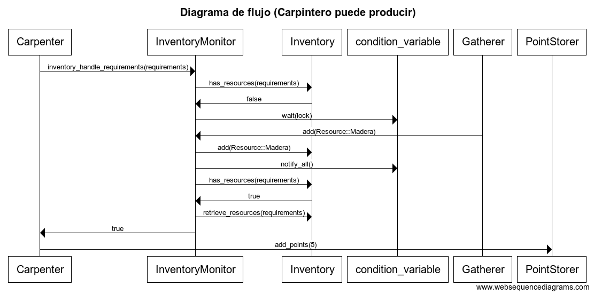

Padron: 98757
Nombre: Pinto Tomas Eduardo
Repositorio: https://github.com/pintotomas/tp2

## Descripcion

Para resolver el trabajo practico primero implemente una cola bloqueante donde el thread principal (Orchestator) se encarga de llenarla con recursos los cuales luego seran obtenidos por los recolectores. A la hora de hacer push y pop en la cola esta se bloquea para que los demas recolectores o el orchestator no la modifiquen mientras quien esta operando esta haciendo sus cambios. 

Cuando un recolector obtiene un recurso, este lo inserta en un inventario que tambien es protegido por un monitor, cada una de sus operaciones publicas, como en la cola bloqueante, son atomizadas mediante un lock. 

El monitor del inventario tambien es compartido con los productores, mientras los recolectores guardan recursos en el inventario, los productores los utilizan si encuentran la cantidad que necesitan. Donde se resuelven los posibles conflictos con los recolectores es en el metodo inventory_handle_requirements, que opera de la siguiente manera: 

1) Cuando instanciamos a un productor, inmediatamente se llama a este metodo para intentar obtener tantos recursos como necesite 

2) Si el inventario tiene los recursos necesarios, devuelve True al productor

3) Si no se tienen los recursos requeridos ni hay recolectores trabajando, se lanza una excepcion que debe manejar el productor

4) Si no se tienen los recursos requeridos pero aun hay recolectores trabajando, se pone a dormir al thread (Productor) mediante cv.wait(). 

5) El productor sera despertado si: 

	a) Se agregan nuevos recursos en el inventario 
	b) No hay mas recolectores trabajando

En ambos casos a) y b) se vuelve al paso 2). 

Una vez que el productor obtuvo los recursos que necesitaba (Obtiene un True de parte del InventoryMonitor) accede a un acumulador de puntos compartido por todos los trabajadores, que, nuevamente, debe ser protegido para evitar fallas mediante el uso de locks. Se atomiza la operacion de incrementar el contador de puntos, y, finalmente, cuando tanto recolectores y productores dejan de trabajar, el Orchestator muestra los recursos que no se utilizaron y cuantos puntos se obtuvieron por los recursos trabajados.
 
## Diagramas

En este diagrama muestro como un recolector toma recursos de la cola y los envia al inventario a traves de un monitor. Al no haber recursos en la cola y obviando que no esta cerrada, espera hasta que el Orchestator haga un push de un recurso a la cola para obtenerlo y asi devolverlo al recolector para finalizar su tarea.

En este diagrama muestro como un productor intenta obtener recursos a traves del monitor del inventario. En un principio, el inventario no tiene todos los recursos necesario por lo que hago que el thread espere hasta que luego se agrega un nuevo recurso, se notifica al thread (carpintero) para que vuelva a intentar obtener los recursos y al obtener una respuesta exitosa (se encuentran todos los recursos necesarios) se informa al productor y este suma puntos en un almacenador de puntos compartido.

Nota: Omiti la llamada a lock(mutex) al acceder al monitor para hacer al diagrama mas legible

## Aclaraciones
